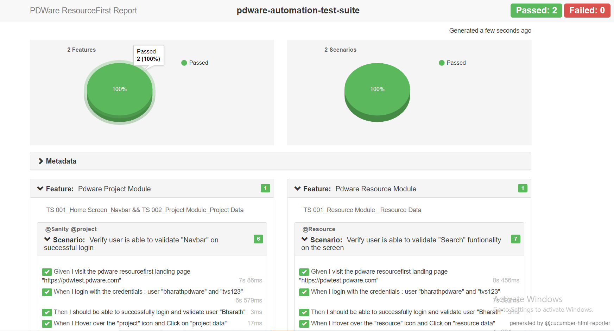

# PDWare e2e Automation

## Getting Started

These instructions will get you a copy of the project up and running on your local machine.

### Prerequisites

What things you need to install the software and how to install them

```
NodeJS
NPM
Visual studio code or any IDE
```

### Installing

Download and install NodeJS from

```
https://nodejs.org/dist/v12.11.1/node-v12.11.1-x64.msi
```

NPM will be installed by default with Node. Check node and npm installation by running the below commands

```
node --version && npm --version
```

## Clone

clone the repo from `https://pdware.visualstudio.com/DefaultCollection/ResourceFirstTesting/_git/ResourceFirstTesting`

cd to the folder and run `npm i` in terminal to pull all dependencies from `npm.org`

## Test feature file

Test feature file is located at

```
./features/feature files/**/*.feature
```

## Utility helper methods file

Utility helper methods are at

```
./features/utilities/action.js
./features/utilities/check.js

click: async (page, locator) => {
    try {
      await page.waitForSelector(locator, { visible: true, timeout: 30000 });
      await page.focus(locator);
      await page.click(locator);
    } catch (err) {
      console.log(`${err} ${locator} issue`);
    }
  }

 contains: async (Actual, Expected, failcase) => {
    if (failcase) {
      return expect(Actual).to.not.contain(Expected);
    }
    return expect(Actual).to.contain(Expected);
  },

  visible: async (selector, failcase) => {
    if (failcase) {
      await page.waitForSelector(selector, { visible: false});
    } else {
      await page.waitForSelector(selector, { visible: true});
    }
  },

```

## Reusable modules file

Reusable modules are located at

```
./features/components/**/*.js
./features/page-objects/**/*.js

async click_navigation_link(icon, link) {
        return new Promise(async (resolve, reject) => {
            try {
                switch (String(icon)) {
                    case `resource`:
                        let { Capacity, Utilization, assignments, requests, resourceData, skillAnalysis, teams } = locators.navbar.resource.links
                        await action.hover(this.page, locators.navbar.resource.icon);
                        switch (String(link)) {
                            case `resource data`:
                                await action.click(this.page, resourceData);
                                break;
                        }
                        break;
                    case `project`:
                        let { Assignments, Backlogs, Demand, FTE_Target, Initiation, Project_Data, Requests, Scenarios } = locators.navbar.project.links;
                        if (link === `project data` && (await this.page.$(`[id="ProjectList_header-title"]`) !== null)) {

                        }
                        else {
                            await action.hover(this.page, locators.navbar.project.icon);
                            switch (String(link)) {
                                case `project data`:
                                    await action.click(this.page, Project_Data);
                                    break;
                            }
                        }
                        break;
                }
                return resolve(true);
            }
            catch (err) {
                console.log(`${err} issue`);
            }
        })
    }
```

## Webelements locators file

Webelements locators is located at

```
./features/components/**/*.js
./features/page-objects/**/*.js

const locator = {
    add: `.fa-plus`,
    deletebtn: `.x-toolbar [data-qtip="Delete"][data-qtip="Delete"]`,
    showSkillsGrid: `[data-qtip="Show Skills Grid"]`,
    exportbtn: `.fa-file-export`,
    importbtn: `[data-qtip="Import"]`,
    save: `.fa-save`,
    editViews: `[data-qtip="Edit Views"]`,
    viewSelection: `[data-componentid="rViews"]`,
    clearAllFilters: `[data-qtip="Clear All Filters"]`,
    nextRow: `[data-qtip="Find Next Row"]`,
    previousRow: `[data-qtip="Find Previous Row"]`,
    search: `[id="rlSearchText-targetEl"] input`,
    firstTuple: `[id="ResourceList-body"] td:nth-child(2)`,
    firstTupleSelect: `[id="ResourceList-body"] td:nth-child(1)`,
    yes: `"Yes"`,
    no: `"No"`,
    showSkillsGridOption:{
        add: `[id="pnlSkillData"] [aria-label="Add"]`,
        deleteIcon: `[id="pnlSkillData"] [data-qtip="Delete"]`,
        save: `[id="pnlSkillData"] [data-qtip="Save"]`
    },
    getSelectedRecordName: `.x-grid-item-selected .x-grid-cell-last`
}

```

## Running the tests

In the project folder run the below command. test is a script command in package.json

To run all features in headful mode

```
npm run test
```

## Reports

`npm run report` to generate and view html reports.

